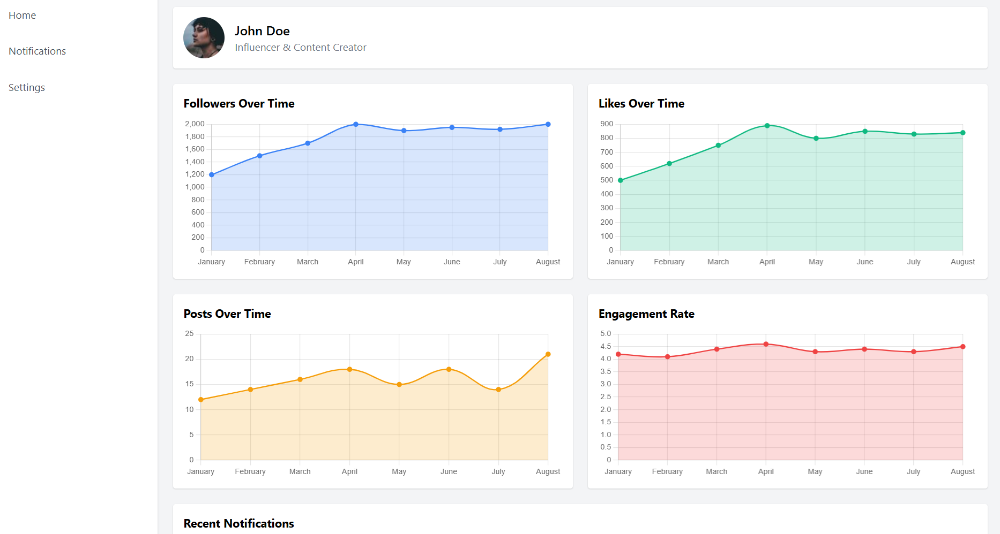
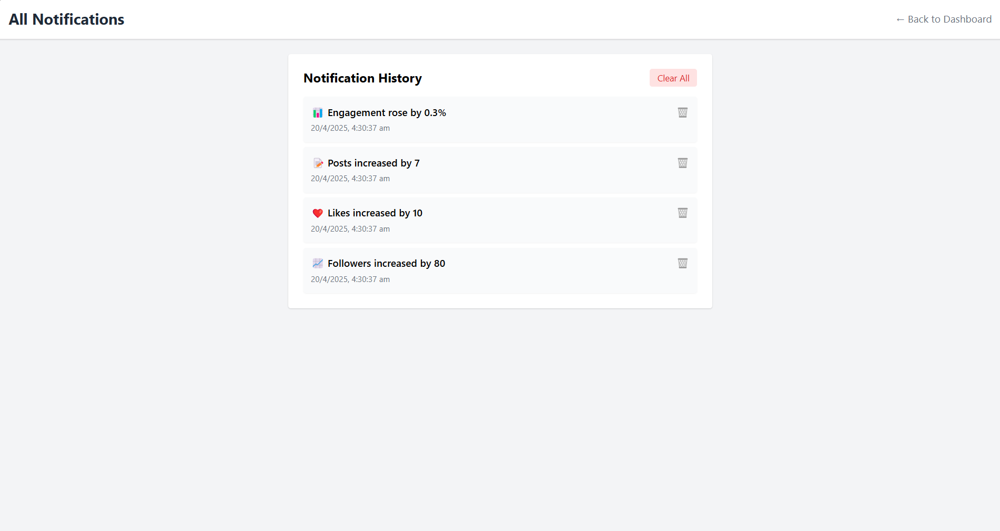

# 💸 SpendSense – Smart Expense Tracker

**SpendSense** is a modern, minimal, and intuitive expense tracking app built with **HTML**, **Tailwind CSS**, and **JavaScript**. It allows users to manage their income and expenses, view visual summaries, and analyze spending patterns with interactive charts – all while storing data locally in the browser.

---

## 🌟 Features

### ✅ Expense Management
- Add income and expense transactions with descriptions and categories
- Edit or delete existing transactions easily
- Dynamic balance calculation with color-coded income/expense display

### 📊 Visual Insights
- **Pie chart** to visualize expense distribution across categories
- **Hover** over chart segments to see **percentage** of total spend
- Auto-updates with every transaction addition or deletion

### 🌓 Theme Toggle
- Supports **light** and **dark** mode with a sleek toggle switch
- Theme preference is saved in `localStorage` and persists across sessions
- Chart legends adapt to dark/light mode for improved visibility

### 💾 Persistent Data Storage
- All transactions are saved using the browser's `localStorage`
- Data persists even after reloading or closing the browser

### ✨ Responsive & Stylish UI
- Responsive layout using **Tailwind CSS**
- Clean, modern design with accessible components
- Mobile-friendly structure

---

## 📷 Screenshots

 | 

---

## 🚀 Getting Started

1. Clone the repo:
   ```bash
   git clone https://github.com/suryanshrai1/SpendSense.git
   ```
2. Open `index.html` in your browser – no setup required!

---

## 📌 Future Improvements (Optional Ideas)
- Monthly budget targets
- Category-wise history filters
- Export data to CSV
- Login system using Firebase
- Integration with a database backend

---

## 🛠️ Built With
- **HTML**
- **Tailwind CSS**
- **JavaScript**
- **Chart.js** – for visualizing expenses

---

## 📄 License

This project is open-source and available under the [MIT License](LICENSE).

---

## 🙌 Acknowledgements
- [Tailwind CSS](https://tailwindcss.com/)
- [Chart.js](https://www.chartjs.org/)
```

